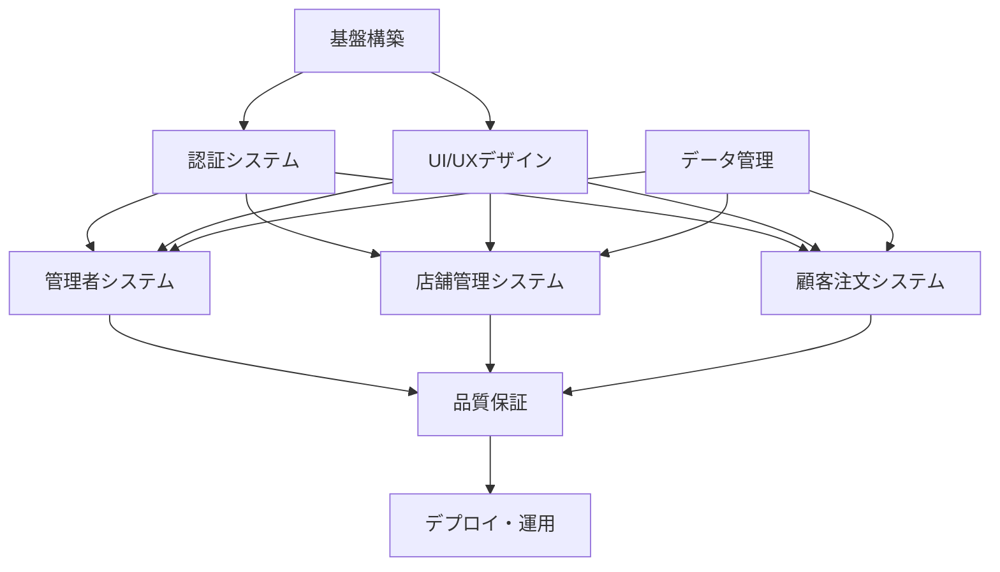

# フロントエンド開発役務定義書

## 開発役務一覧

### 1. 基盤構築役務

**責務**: プロジェクトの技術基盤とアーキテクチャの構築

#### 1.1 環境セットアップ

- Next.js プロジェクト初期化
- TypeScript + App Router 設定
- Ant Design 5.x 統合設定
- ESLint/Prettier 設定
- 開発環境構築

#### 1.2 共通基盤実装

- API クライアント設定 (Axios)
- 認証システム基盤 (JWT)
- 状態管理設定 (React Query + Zustand)
- エラーハンドリング機構
- ローディング状態管理

#### 1.3 レイアウトシステム

- 共通レイアウトコンポーネント
- レスポンシブデザイン基盤
- ナビゲーション構造
- テーマ設定

### 2. 認証システム役務

**責務**: ユーザー認証とアクセス制御の実装

#### 2.1 認証画面実装

- 管理者ログイン画面 (`/auth/admin-login`)
- 店舗ログイン画面 (`/auth/store-login`)
- ログアウト機能
- 認証エラーハンドリング

#### 2.2 認証状態管理

- JWT トークン管理
- ユーザー情報状態管理
- 認証状態永続化
- セッション管理

#### 2.3 アクセス制御

- ルートガード実装
- 権限別画面制御
- 未認証時リダイレクト
- 認証チェック機能

### 3. 管理者システム役務

**責務**: 店舗発行管理者向け機能の実装

#### 3.1 管理者ダッシュボード

- 全体統計表示 (`/admin/dashboard`)
- アクティビティ監視
- システム状態表示
- データ可視化

#### 3.2 店舗管理機能

- 店舗一覧表示 (`/admin/stores`)
- 店舗登録・編集・削除
- 店舗詳細情報管理
- 店舗検索・フィルタリング

#### 3.3 管理者管理機能

- 管理者一覧表示 (`/admin/managers`)
- 管理者登録・編集・削除
- 権限管理
- アクセス履歴管理

### 4. 店舗管理システム役務

**責務**: 店舗管理者向け機能の実装

#### 4.1 店舗ダッシュボード

- 店舗統計表示 (`/store/dashboard`)
- 今日の注文状況
- 売上データ表示
- 座席稼働状況

#### 4.2 座席管理機能

- 座席一覧・編集 (`/store/seats`)
- QRコード生成・表示
- 座席レイアウト管理
- 座席状態管理

#### 4.3 注文管理機能

- 注文一覧表示 (`/store/orders`)
- 注文ステータス更新
- 注文詳細表示
- 注文履歴管理

#### 4.4 メニュー管理機能

- メニュー一覧・編集 (`/store/menu`)
- カテゴリ管理
- 価格管理
- メニュー画像管理

### 5. 顧客注文システム役務

**責務**: 顧客向け注文インターフェースの実装

#### 5.1 注文画面実装

- メニュー表示 (`/order/[sessionId]`)
- 注文カート機能
- 注文確定処理
- セッション管理

#### 5.2 注文フロー管理

- 注文追加・削除
- 数量変更
- 小計計算
- 注文履歴表示

#### 5.3 顧客体験最適化

- モバイル最適化
- タッチ操作対応
- 直感的UI設計
- エラー防止機能

### 6. UI/UXデザイン役務

**責務**: ユーザーインターフェースとユーザー体験の設計・実装

#### 6.1 コンポーネント設計

- 再利用可能コンポーネント
- Ant Design カスタマイズ
- アクセシビリティ対応
- パフォーマンス最適化

#### 6.2 レスポンシブデザイン

- モバイルファースト設計
- タブレット対応
- デスクトップ最適化
- 画面サイズ別レイアウト

#### 6.3 ユーザビリティ向上

- 操作フィードバック
- ローディング状態表示
- エラーメッセージ設計
- 操作ガイダンス

### 7. データ管理役務

**責務**: データの取得、更新、キャッシュ管理

#### 7.1 API連携実装

- RESTful API 通信
- データフェッチング最適化
- エラーハンドリング
- リトライ機能

#### 7.2 状態管理実装

- グローバル状態管理
- ローカル状態管理
- データキャッシュ戦略
- 状態同期

#### 7.3 データ検証・変換

- 入力値検証
- データ型変換
- フォーマット処理
- バリデーション

### 8. 品質保証役務

**責務**: コード品質とアプリケーション品質の保証

#### 8.1 コード品質管理

- TypeScript 型安全性
- ESLint ルール適用
- コードレビュー
- リファクタリング

#### 8.2 テスト実装

- ユニットテスト
- 統合テスト
- E2Eテスト
- パフォーマンステスト

#### 8.3 デバッグ・最適化

- バグ修正
- パフォーマンス改善
- メモリ使用量最適化
- バンドルサイズ最適化

### 9. デプロイ・運用役務

**責務**: アプリケーションのデプロイと運用管理

#### 9.1 ビルド・デプロイ設定

- Next.js ビルド設定
- 静的ファイル最適化
- Google Cloud Storage 連携
- 環境別設定管理

#### 9.2 監視・メンテナンス

- エラー監視
- パフォーマンス監視
- ログ管理
- セキュリティ更新

## 役務間の依存関係

## 開発優先順位

### Phase 1: 基盤構築 (Week 1)

1. 基盤構築役務
2. 認証システム役務
3. UI/UXデザイン役務（基本部分）

### Phase 2: 管理機能 (Week 2-3)

1. 管理者システム役務
2. データ管理役務（管理者向け）
3. 品質保証役務（管理者機能）

### Phase 3: 店舗管理 (Week 4-5)

1. 店舗管理システム役務
2. データ管理役務（店舗向け）
3. 品質保証役務（店舗機能）

### Phase 4: 顧客機能 (Week 6)

1. 顧客注文システム役務
2. UI/UXデザイン役務（顧客向け最適化）
3. 品質保証役務（顧客機能）

### Phase 5: 統合・運用 (Week 7)

1. 品質保証役務（統合テスト）
2. デプロイ・運用役務
3. 最終調整・最適化

## 成果物定義

各役務で作成される成果物は `FILE_STRUCTURE.md` で詳細に定義されています。

## 品質基準

- **TypeScript**: 厳格な型チェック、型安全性100%
- **コードカバレッジ**: 80%以上
- **パフォーマンス**: Lighthouse スコア90以上
- **アクセシビリティ**: WCAG 2.1 AA準拠
- **レスポンシブ**: 全デバイス対応
- **ブラウザ対応**: Chrome, Firefox, Safari, Edge 最新版
